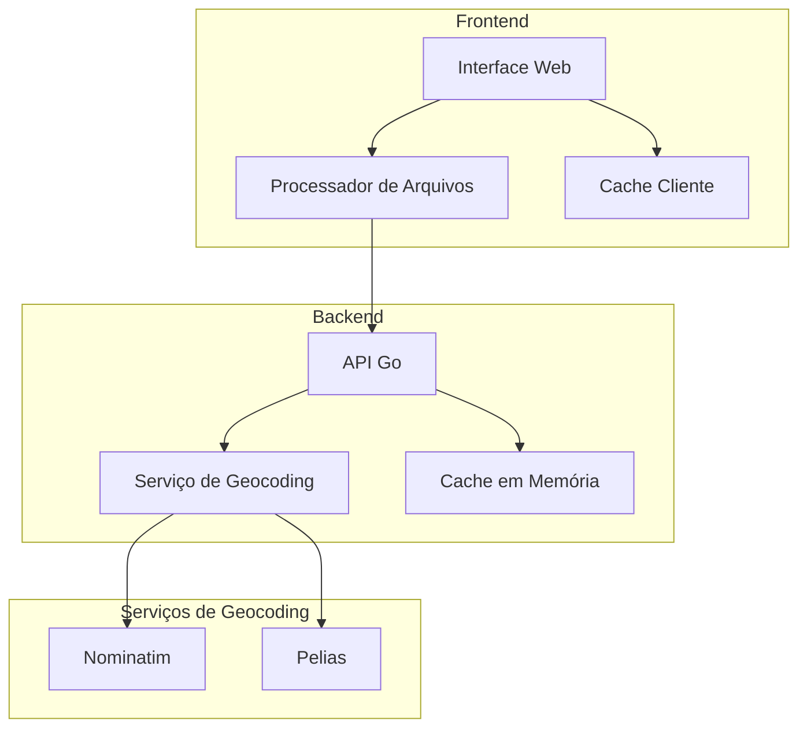
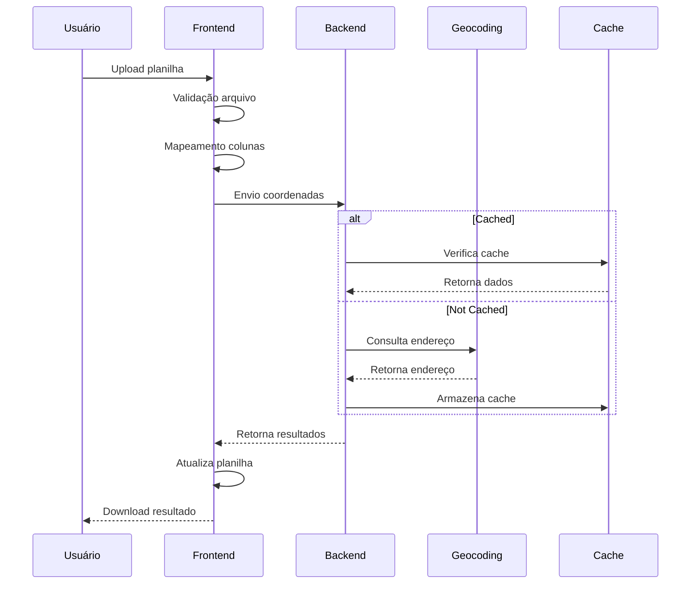

# Address Extractor

Serviço de extração e enriquecimento de endereços a partir de coordenadas geográficas.

## 🌟 Visão Geral

O Address Extractor é uma solução completa para processar coordenadas geográficas e obter informações detalhadas de endereços, permitindo tanto consultas individuais quanto processamento em lote através de planilhas.

### Para o Time de Produto

O Address Extractor resolve o desafio de enriquecer bases de dados com informações precisas de endereços a partir de coordenadas geográficas. Principais benefícios:

- Interface intuitiva para upload de planilhas
- Processamento em lote eficiente
- Consultas individuais rápidas
- Flexibilidade no mapeamento de dados
- Download dos resultados em formato Excel
- Tema escuro para menor fadiga visual

### Para o Time Técnico

Sistema distribuído construído com:
- Frontend: Next.js 14, TypeScript, Tailwind CSS
- Backend: Go 1.20, Docker
- Geocoding: Nominatim/Pelias
- Cache em memória para otimização

## 🏗 Arquitetura



## 🔄 Fluxo de Dados



## 🚀 Exemplos de Uso

### API REST

#### Consulta Individual

```bash
curl -X POST http://localhost:5000/geocode \
  -H "Content-Type: application/json" \
  -d '{
    "latitude": -23.557467,
    "longitude": -46.689294
  }'
```

Resposta:
```json
{
  "success": true,
  "address": {
    "street": "Rua Lourenço Marques",
    "number": "297",
    "city": "São Paulo",
    "state": "SP",
    "country": "Brasil",
    "postalCode": "04547-100",
    "latitude": -23.557467,
    "longitude": -46.689294
  }
}
```

#### Processamento em Lote

```bash
curl -X POST http://localhost:5000/batch \
  -H "Content-Type: application/json" \
  -d '{
    "coordinates": [
      {
        "latitude": -23.557467,
        "longitude": -46.689294
      },
      {
        "latitude": -23.550520,
        "longitude": -46.633308
      }
    ]
  }'
```