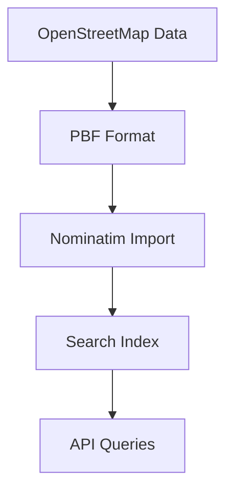

# Casos de Uso Estendidos

## 🛣️ Consulta de Rodovias

### Exemplo: Rodovia Presidente Dutra (BR-116)

```http
POST /geocode
Content-Type: application/json

{
  "latitude": -23.4245,
  "longitude": -46.4844
}
```

Resposta:
```json
{
  "success": true,
  "address": {
    "road": "Rodovia Presidente Dutra",
    "reference": "Km 223",
    "city": "Guarulhos",
    "state": "SP",
    "country": "Brasil",
    "highway": {
      "code": "BR-116",
      "name": "Rodovia Presidente Dutra",
      "kilometer": 223,
      "direction": "Rio de Janeiro",
      "type": "federal"
    }
  }
}
```

### Exemplo: Rodovia dos Bandeirantes (SP-348)

```http
POST /geocode
Content-Type: application/json

{
  "latitude": -23.3548,
  "longitude": -46.9732
}
```

Resposta:
```json
{
  "success": true,
  "address": {
    "road": "Rodovia dos Bandeirantes",
    "reference": "Km 47",
    "city": "Jundiaí",
    "state": "SP",
    "country": "Brasil",
    "highway": {
      "code": "SP-348",
      "name": "Rodovia dos Bandeirantes",
      "kilometer": 47,
      "direction": "Campinas",
      "type": "state"
    }
  }
}
```

## 🗺️ Importação de Mapas

### Estrutura dos Dados OSM



### Fontes de Dados

1. **Geofabrik Downloads**
   ```bash
   # São Paulo
   wget https://download.geofabrik.de/south-america/brazil/sudeste/sao-paulo-latest.osm.pbf

   # Brasil Completo
   wget https://download.geofabrik.de/south-america/brazil-latest.osm.pbf

   # Região Sudeste
   wget https://download.geofabrik.de/south-america/brazil/sudeste-latest.osm.pbf
   ```

2. **Downloads por Estado**
   ```bash
   # Lista de URLs por estado
   declare -A STATE_URLS=(
    ["SP"]="sao-paulo-latest.osm.pbf"
    ["RJ"]="rio-de-janeiro-latest.osm.pbf"
    ["MG"]="minas-gerais-latest.osm.pbf"
    ["ES"]="espirito-santo-latest.osm.pbf"
   )
   ```

### Script de Importação Multi-região

```bash
#!/bin/bash

# Configurações
IMPORT_DIR="/data/imports"
NOMINATIM_DIR="/data/nominatim"
declare -A REGIONS=(
    ["sp"]="sao-paulo"
    ["rj"]="rio-de-janeiro"
    ["mg"]="minas-gerais"
)

# Função para importar região
import_region() {
    local region_code=$1
    local region_name=${REGIONS[$region_code]}
    local pbf_url="https://download.geofabrik.de/south-america/brazil/${region_name}-latest.osm.pbf"
    
    echo "Importando região: ${region_name}"
    
    # Download do arquivo PBF
    wget -O "${IMPORT_DIR}/${region_code}.osm.pbf" "$pbf_url"
    
    # Importar para Nominatim
    nominatim import \
        --osm-file "${IMPORT_DIR}/${region_code}.osm.pbf" \
        --import-data \
        --index-addresses
}

# Importar múltiplas regiões
import_multiple() {
    for region in "$@"; do
        if [ -n "${REGIONS[$region]}" ]; then
            import_region "$region"
        else
            echo "Região não encontrada: $region"
        fi
    done
}

# Exemplo de uso
# ./import.sh sp rj mg
```

### Requisitos de Hardware por Região

| Região         | RAM Mínima | Espaço em Disco | Tempo Estimado* |
|---------------|------------|-----------------|-----------------|
| São Paulo     | 8GB        | 50GB            | 2-3 horas      |
| Sudeste       | 16GB       | 150GB           | 6-8 horas      |
| Brasil        | 32GB       | 500GB           | 24-48 horas    |

*Tempos estimados em hardware moderno (CPU 8 cores, SSD)

### Otimizações por Região

```bash
# Configurações do PostgreSQL por tamanho de região
case $REGION_SIZE in
    "small") # Estados menores
        shared_buffers="2GB"
        work_mem="50MB"
        maintenance_work_mem="2GB"
        ;;
    "medium") # Estados grandes/regiões
        shared_buffers="4GB"
        work_mem="100MB"
        maintenance_work_mem="4GB"
        ;;
    "large") # Brasil completo
        shared_buffers="8GB"
        work_mem="200MB"
        maintenance_work_mem="8GB"
        ;;
esac
```

### Atualizações Incrementais

```bash
#!/bin/bash

# Atualização diária de diferenças
update_region() {
    local region=$1
    local diff_url="https://download.geofabrik.de/south-america/brazil/${region}-updates/"
    
    # Baixar arquivo de diferenças
    wget -O diff.osc.gz "${diff_url}/changes-daily.osc.gz"
    
    # Aplicar diferenças
    nominatim replication --project-dir="$NOMINATIM_DIR" \
        --import-diff diff.osc.gz
}

# Programar atualização
# 0 4 * * * /scripts/update.sh sp  # Atualizar SP todos os dias às 4h
```

### Considerações de Produção

1. **Backup de Dados**
   ```bash
   # Backup do banco de dados Nominatim
   pg_dump -U nominatim nominatim > backup_$(date +%Y%m%d).sql

   # Backup dos arquivos PBF
   tar -czf osm_files_$(date +%Y%m%d).tar.gz /data/imports/*.osm.pbf
   ```

2. **Monitoramento de Importação**
   ```bash
   # Status da importação
   nominatim status

   # Progresso detalhado
   nominatim status --progress

   # Verificação de integridade
   nominatim check-database
   ```

3. **Recuperação de Erros**
   ```bash
   # Limpar dados corrompidos
   nominatim clean

   # Reindexar base
   nominatim reindex

   # Reiniciar importação preservando dados existentes
   nominatim import --continue
   ```