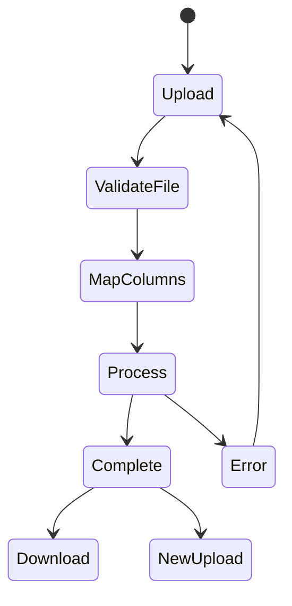

# Documentação do Frontend

## 🎨 Interface do Usuário

### Tema Dracula

O sistema utiliza uma adaptação do tema Dracula para melhor legibilidade e menor fadiga visual.

```typescript
// Cores principais
const colors = {
  background: '#282a36',
  current: '#44475a',
  foreground: '#f8f8f2',
  comment: '#6272a4',
  purple: '#bd93f9',
  cyan: '#8be9fd',
  green: '#50fa7b',
  red: '#ff5555',
}
```

### Componentes Base

#### Button
```typescript
import { Button } from '@/components/ui/Button'

// Exemplos de uso
<Button>Botão Padrão</Button>
<Button variant="secondary">Secundário</Button>
<Button isLoading>Carregando...</Button>
```

#### Select
```typescript
import { Select } from '@/components/ui/Select'

<Select
  value={selectedValue}
  onValueChange={setValue}
  options={[
    { value: 'lat', label: 'Latitude' },
    { value: 'lng', label: 'Longitude' },
  ]}
/>
```

### Componentes Específicos

#### FileUpload
```typescript
import FileUpload from '@/components/FileUpload'

<FileUpload
  onFileSelected={(file) => processFile(file)}
  accept={['.xlsx', '.csv']}
  maxSize={10 * 1024 * 1024} // 10MB
/>
```

#### ColumnMapping
```typescript
import ColumnMapping from '@/components/ColumnMapping'

<ColumnMapping
  columns={fileColumns}
  onMappingComplete={(mapping) => startProcessing(mapping)}
/>
```

#### ProcessingStatus
```typescript
import ProcessingStatus from '@/components/ProcessingStatus'

<ProcessingStatus
  current={50}
  total={100}
  status="Processando registros..."
  isComplete={false}
/>
```

## 🔄 Fluxo de Dados

### Upload e Processamento



### Gestão de Estado

```typescript
interface ProcessingState {
  status: 'idle' | 'uploading' | 'mapping' | 'processing' | 'complete' | 'error';
  progress: {
    current: number;
    total: number;
  };
  error?: string;
  result?: ProcessingResult;
}
```

## 📱 Responsividade

O sistema é totalmente responsivo, adaptando-se a diferentes tamanhos de tela:

- Desktop (> 1024px)
- Tablet (768px - 1024px)
- Mobile (< 768px)

```typescript
// Exemplo de classes Tailwind responsivas
const containerClasses = `
  w-full
  p-4
  md:p-6
  lg:p-8
  max-w-7xl
  mx-auto
`
```

## ⚡ Performance

### Otimizações

1. **Carregamento de Arquivos**
   - Streaming de dados grandes
   - Processamento em chunks
   - Validação client-side

```typescript
const processLargeFile = async (file: File) => {
  const chunkSize = 1024 * 1024; // 1MB
  const chunks = Math.ceil(file.size / chunkSize);
  
  for (let i = 0; i < chunks; i++) {
    const chunk = file.slice(
      i * chunkSize,
      Math.min((i + 1) * chunkSize, file.size)
    );
    await processChunk(chunk);
  }
};
```

2. **Cache**
   - Resultados de geocodificação
   - Componentes React
   - Requests HTTP

```typescript
import { useQuery } from 'react-query'

const useGeocode = (coordinates: Coordinates) => {
  return useQuery(
    ['geocode', coordinates],
    () => geocodeAddress(coordinates),
    {
      staleTime: 1000 * 60 * 60, // 1 hora
      cacheTime: 1000 * 60 * 60 * 24, // 24 horas
    }
  );
};
```

## 🔍 Monitoramento

### Analytics
```typescript
const trackEvent = (event: string, data?: Record<string, any>) => {
  // Implementação do analytics
};

// Exemplo de uso
trackEvent('file_upload_start', { fileSize, fileType });
trackEvent('processing_complete', { recordsProcessed });
```

### Error Tracking
```typescript
const errorBoundary = {
  onError: (error: Error, errorInfo: React.ErrorInfo) => {
    // Log do erro
    console.error(error);
    // Envio para serviço de monitoramento
    reportError(error, errorInfo);
  }
};
```

## 🧪 Testes

```bash
# Executar todos os testes
npm run test

# Executar testes com coverage
npm run test:coverage

# Executar testes específicos
npm run test -- --grep "FileUpload"
```

### Exemplo de Teste
```typescript
import { render, fireEvent } from '@testing-library/react'
import FileUpload from '@/components/FileUpload'

describe('FileUpload', () => {
  it('deve aceitar arquivo válido', async () => {
    const onFileSelected = jest.fn()
    const { getByTestId } = render(
      <FileUpload onFileSelected={onFileSelected} />
    )

    const file = new File(['content'], 'test.xlsx', {
      type: 'application/vnd.openxmlformats-officedocument.spreadsheetml.sheet'
    })

    const input = getByTestId('file-input')
    await fireEvent.change(input, { target: { files: [file] } })

    expect(onFileSelected).toHaveBeenCalledWith(file)
  })
})
```