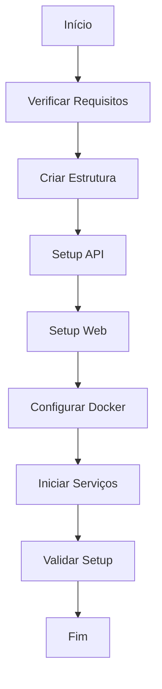

# Scripts e Automação

## 📂 Estrutura

```bash
scripts/
├── setup.sh           # Setup inicial
├── deploy.sh          # Deploy em produção
├── monitor.sh         # Monitoramento
├── maintenance.sh     # Manutenção
└── update-data.sh     # Atualização de dados
```

## 🚀 Scripts Principais

### Setup (setup.sh)

Script principal de instalação e configuração do sistema.

```bash
./scripts/setup.sh [--clean] [--debug] [--no-cache]
```

Opções:
- `--clean`: Limpa instalação anterior
- `--debug`: Modo debug
- `--no-cache`: Não utiliza cache do Docker

#### Fluxo de Execução



### Deploy (deploy.sh)

Script para deploy em ambiente de produção.

```bash
./scripts/deploy.sh [ambiente] [--force] [--backup]
```

#### Exemplo de Configuração

```bash
# Configuração de ambiente
DEPLOY_CONFIG=(
    "production:servidor-prod:5000"
    "staging:servidor-staging:5001"
)

# Backup automático
BACKUP_RETENTION=5
BACKUP_PATH="/backups/address-extractor"

# Healthcheck
HEALTH_CHECK_RETRIES=3
HEALTH_CHECK_INTERVAL=10
```

### Monitoramento (monitor.sh)

Script para monitoramento do sistema em produção.

```bash
./scripts/monitor.sh [--alert-disk=80] [--alert-memory=90]
```

#### Métricas Coletadas

```bash
# Uso de sistema
METRICS=(
    "cpu_usage"
    "memory_usage"
    "disk_usage"
    "network_io"
)

# Métricas da aplicação
APP_METRICS=(
    "requests_per_second"
    "average_response_time"
    "error_rate"
    "cache_hit_ratio"
)
```

### Manutenção (maintenance.sh)

Script para tarefas de manutenção.

```bash
./scripts/maintenance.sh [operação]
```

Operações disponíveis:
- `cleanup`: Limpa arquivos temporários
- `optimize`: Otimiza banco de dados
- `backup`: Realiza backup
- `rotate-logs`: Rotaciona logs

## 🔄 Automações

### CI/CD (.github/workflows)

#### Build e Teste
```yaml
name: CI

on:
  push:
    branches: [ main ]
  pull_request:
    branches: [ main ]

jobs:
  test:
    runs-on: ubuntu-latest
    steps:
      - uses: actions/checkout@v3
      
      - name: Setup Go
        uses: actions/setup-go@v3
        with:
          go-version: '1.20'
          
      - name: Run Tests
        run: go test ./...
        
      - name: Build
        run: go build ./cmd/server
```

#### Deploy Automático
```yaml
name: Deploy

on:
  push:
    tags:
      - 'v*'

jobs:
  deploy:
    runs-on: ubuntu-latest
    steps:
      - uses: actions/checkout@v3
      
      - name: Deploy to Production
        uses: some-deploy-action@v1
        with:
          host: ${{ secrets.PROD_HOST }}
          key: ${{ secrets.SSH_KEY }}
```

## 📊 Logging

### Formato de Logs

```typescript
interface LogEntry {
  timestamp: string;
  level: 'INFO' | 'WARNING' | 'ERROR';
  service: string;
  message: string;
  metadata?: Record<string, any>;
}
```

### Exemplo de Log
```json
{
  "timestamp": "2023-11-10T14:30:00Z",
  "level": "INFO",
  "service": "address-extractor",
  "message": "Processamento de arquivo concluído",
  "metadata": {
    "fileName": "addresses.xlsx",
    "recordsProcessed": 1000,
    "duration": "5m30s"
  }
}
```

## 🔧 Manutenção

### Rotação de Logs
```bash
# Configuração do logrotate
/var/log/address-extractor/*.log {
    daily
    missingok
    rotate 7
    compress
    delaycompress
    notifempty
    create 0640 www-data www-data
}
```

### Backup Automático
```bash
# Backup diário
0 0 * * * /scripts/backup.sh --full > /var/log/backup.log 2>&1

# Backup incremental
0 */6 * * * /scripts/backup.sh --incremental > /var/log/backup-inc.log 2>&1
```

## 🚨 Alertas

### Configuração de Alertas

```bash
# Thresholds
DISK_THRESHOLD=80
MEMORY_THRESHOLD=90
ERROR_RATE_THRESHOLD=5

# Canais de notificação
NOTIFICATION_CHANNELS=(
    "slack:#monitoring"
    "email:admin@example.com"
    "pagerduty:service-key"
)
```

### Exemplo de Alerta
```json
{
  "type": "alert",
  "severity": "high",
  "source": "address-extractor",
  "metric": "disk_usage",
  "value": 85,
  "threshold": 80,
  "message": "Uso de disco acima do limite",
  "timestamp": "2023-11-10T14:30:00Z"
}
```